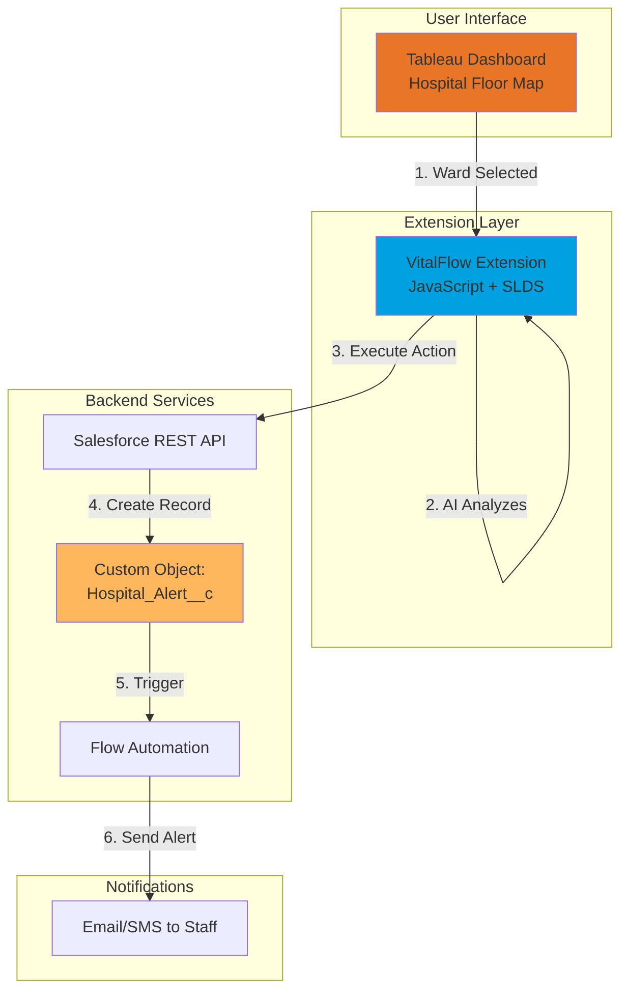

# 🏥 VitalFlow: AI-Assisted Hospital Command Center

[](https://www.tableau.com/)
[](https://www.salesforce.com/)
[](https://developer.mozilla.org/en-US/docs/Web/JavaScript)
[](LICENSE)

> **Transforming passive analytics into active command centers**  
> Closing the Data-Action Gap in critical healthcare operations

---

## 🎯 The Problem

Hospitals generate massive amounts of data every second, but current Business Intelligence tools are **passive**. When an ER reaches critical capacity, administrators must:

1. 👀 **See** the alert on a dashboard
2. 🔄 **Switch** to a different system (phone, email, HR portal)
3. 📞 **Manually** locate and notify staff
4. ⏰ **Wait** for confirmation and action

**This friction costs time. In healthcare, time costs lives.**

---

## 💡 The Solution

**VitalFlow** bridges the Data-Action Gap by transforming Tableau from a read-only dashboard into an **intelligent command center**.

### Key Innovation: "Closed-Loop Analytics"
```
📊 Insight → 🤖 AI Recommendation → ⚡ One-Click Action → ✅ Automated Execution
```

### What Makes This Different?
- **Contextual AI Agent:** Analyzes ward capacity and suggests optimal actions
- **Write-Back Integration:** Triggers real-world operations via Salesforce API
- **Optimistic UI:** Instant feedback without waiting for database confirmation
- **Automated Workflows:** Sends SMS/email alerts to staff immediately

---

## 🏗️ Architecture



### Tech Stack

| Layer | Technology | Purpose |
|-------|-----------|---------|
| **Visualization** | Tableau Cloud | Real-time hospital metrics dashboard |
| **Extension** | Tableau Extensions API | Custom interactive UI |
| **Frontend** | JavaScript (ES6+) | Business logic and event handling |
| **Styling** | Salesforce Lightning Design System | Native-looking UI components |
| **Backend** | Salesforce REST API | Data persistence and automation |
| **Automation** | Salesforce Flow Builder | Email/SMS notifications |
| **Auth** | OAuth 2.0 | Secure API authentication |

---

## 🚀 Quick Start

### Prerequisites
- Salesforce Developer Org (free): [Sign up](https://developer.salesforce.com/signup)
- Tableau Cloud trial: [Sign up](https://www.tableau.com/products/trial)
- Node.js 18+ and Python 3.x
- Git

### Installation

```bash
# Clone the repository
git clone https://github.com/[username]/vitalflow.git
cd vitalflow

# Navigate to extension directory
cd "w:\tablueau hackathon\VitalFlow\src\extension"

# Start local development server
python -m http.server 8080
```

### Configuration

1. **Salesforce Setup** (see [TASKS.md](TASKS.md) Phase 1):
   - Create `Hospital_Alert__c` custom object
   - Configure Connected App for OAuth
   - Set up CORS whitelist
   - Create Flow automation for email alerts

2. **Tableau Setup** (see [TASKS.md](TASKS.md) Phase 2):
   - Import `hospital_data.csv`
   - Build Hospital Floor Map visualization
   - Publish to Tableau Cloud

3. **Extension Setup** (see [TASKS.md](TASKS.md) Phase 3):
   - Generate OAuth access token
   - Update `app.js` with Salesforce credentials
   - Load `vitalflow.trex` into Tableau dashboard

### First Demo

```bash
# Generate Salesforce access token
sf org display --verbose --target-org vitalflow-dev

# Copy token and update app.js
# SF_CONFIG.accessToken = 'your-token-here'

# Open Tableau Cloud dashboard
# Add extension from http://localhost:8080/vitalflow.trex

# Click on a critical ward (ER) → See recommendation → Execute action
```

---

## 📊 Features

### ✅ Current (MVP)
- [x] Real-time hospital ward visualization with color-coded capacity
- [x] Interactive ward selection with contextual data
- [x] AI-powered action recommendations (rule-based)
- [x] One-click action execution to Salesforce
- [x] Automated email/SMS alerts to staff
- [x] Optimistic UI updates

### 🔮 Future Roadmap
- [ ] **Agentforce Integration:** Replace rule-based logic with Einstein AI
- [ ] **Real-Time Sync:** WebSocket updates without refresh
- [ ] **IoT Integration:** Smart bed sensors for live occupancy
- [ ] **Voice Commands:** "Hey Tableau, deploy nurses to ER"
- [ ] **Mobile App:** iOS/Android companion app
- [ ] **Predictive Analytics:** ML-based capacity forecasting
- [ ] **Multi-Hospital:** Support for hospital networks

---

## 📁 Project Structure

```
VitalFlow/
├── docs/
│   ├── VitalFlow_Master_Design.md    # Complete project specification
│   ├── ARCHITECTURE.md                # System design deep dive
│   └── API_REFERENCE.md               # Salesforce API documentation
├── src/
│   ├── extension/                     # Tableau Extension
│   │   ├── index.html                 # Extension UI
│   │   ├── app.js                     # Main application logic
│   │   ├── salesforce-api.js          # Salesforce integration
│   │   ├── styles.css                 # Custom styling
│   │   └── vitalflow.trex             # Extension manifest
│   ├── salesforce/                    # Salesforce metadata
│   │   ├── objects/                   # Custom object definitions
│   │   └── flows/                     # Flow automation exports
│   └── data/
│       └── hospital_data.csv          # Mock hospital data
├── config/
│   └── salesforce-credentials.json    # OAuth config (gitignored)
├── assets/
│   ├── logo.png                       # VitalFlow branding
│   └── demo-video.mp4                 # Recorded demo
├── TASKS.md                            # Detailed implementation tasks
├── README.md                           # This file
└── .gitignore                          # Git exclusions
```

---

## 🎥 Demo

### Live Demo URL
🔗 [https://vitalflow-demo.tableau.com](https://vitalflow-demo.tableau.com) *(Coming Soon)*

### Video Walkthrough
📹 [Watch on YouTube](https://youtube.com/watch?v=...) *(Coming Soon)*

### Screenshots

| Dashboard Overview | AI Recommendation | Action Execution |
|-------------------|-------------------|------------------|
|  |  |  |

---

## 🧪 Testing

Run the complete test suite:

```bash
# Functional tests
- Click Emergency Room ward (red)
- Verify AI suggests "Deploy Staff" or "Divert Ambulance"
- Click "Execute" button
- Verify success message appears < 2 seconds
- Check Salesforce for new Hospital_Alert__c record
- Check email inbox for notification

# Performance tests
- Measure API response time (target: < 2s)
- Test rapid selections (20+ clicks)
- Load test (50 alerts in 1 minute)

# Cross-browser tests
- Chrome ✅
- Firefox ✅
- Safari ✅
- Edge ✅
```

See [TASKS.md](TASKS.md) Phase 4 for complete testing checklist.

---

## 📖 Documentation

| Document | Description |
|----------|-------------|
| [TASKS.md](TASKS.md) | Complete implementation checklist (200+ tasks) |
| [VitalFlow_Master_Design.md](docs/VitalFlow_Master_Design.md) | System design and requirements |
| [ARCHITECTURE.md](docs/ARCHITECTURE.md) | Technical architecture deep dive *(Coming Soon)* |
| [API_REFERENCE.md](docs/API_REFERENCE.md) | Salesforce API documentation *(Coming Soon)* |
| [USER_GUIDE.md](docs/USER_GUIDE.md) | End-user manual *(Coming Soon)* |

---

## 🤝 Contributing

We welcome contributions! Here's how you can help:

1. 🐛 **Report Bugs:** Open an issue with detailed reproduction steps
2. 💡 **Suggest Features:** Share your ideas for improvements
3. 🔧 **Submit PRs:** Fork, create a branch, and submit a pull request
4. 📚 **Improve Docs:** Help us make documentation clearer

See [CONTRIBUTING.md](CONTRIBUTING.md) for guidelines.

---

## 👥 Team

| Name | Role | Contact |
|------|------|---------|
| [Your Name] | Full-Stack Developer | [@github](https://github.com/username) |
| [Team Member 2] | Salesforce Developer | [@github](https://github.com/username2) |
| [Team Member 3] | UX Designer | [@github](https://github.com/username3) |

---

## 📜 License

This project is licensed under the **MIT License** - see [LICENSE](LICENSE) file for details.

---

## 🙏 Acknowledgments

- **Tableau Developer Platform** for the Extensions API
- **Salesforce Health Cloud** for healthcare data models
- **Lightning Design System** for beautiful UI components
- **Healthcare workers everywhere** who inspired this solution

---

## 📞 Support

- 📧 Email: support@vitalflow.dev
- 💬 Slack: [#vitalflow](https://tableau-dev.slack.com/channels/vitalflow)
- 🐛 Issues: [GitHub Issues](https://github.com/username/vitalflow/issues)
- 📖 Docs: [Documentation Site](https://vitalflow-docs.netlify.app)

---

## ⭐ Show Your Support

If you find VitalFlow useful, please consider:
- ⭐ Starring this repository
- 🐦 Sharing on Twitter/LinkedIn
- 📝 Writing a blog post about your experience
- 🎤 Presenting at your local healthcare tech meetup

---

<p align="center">
  <strong>Made with ❤️ for healthcare workers worldwide</strong><br/>
  <sub>Hackathon Project: Tableau Innovation Challenge 2026</sub>
</p>
