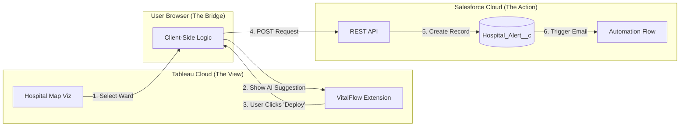

# Project Master Document: VitalFlow

**The AI-Assisted Hospital Command Center**

| **Project Metadata** | Details |
| --- | --- |
| **Track** | Tableau Cloud + Salesforce Developer Platform |
| **Domain** | Health Informatics / Hospital Operations |
| **Tech Stack** | Tableau (Viz), JavaScript (Extension), Salesforce (Backend/Flow) |
| **Core Innovation** | "Closed-Loop Analytics" (Insight → Action → Automation) |

---

## 1. Executive Summary (The "Crux")

**The Problem:** Hospitals suffer from a "Data-Action Gap." Administrators use passive dashboards to see problems (like ER overcrowding) but must switch to disconnected tools (phone, email, HR portals) to fix them. This friction causes delays in critical care.

**The Solution:** VitalFlow transforms the dashboard from a passive monitor into an **active command center**. It integrates a custom "AI Agent" directly into Tableau that detects anomalies and allows users to trigger real-world solutions (deploying staff, diverting ambulances) via a secure write-back to Salesforce.

---

## 2. Requirements Analysis

### **A. Functional Requirements (What it does)**

1. **Real-Time Visualization:** Display live status of Hospital Wards (Occupancy, Wait Time) on a custom map.
2. **Interactive Selection:** Users must be able to click a specific "Ward" on the map to retrieve its specific context.
3. **Intelligent Triage (The Agent):** Upon selection, the system must analyze the data and propose a specific action (e.g., "Deploy 2 Nurses").
4. **Write-Back Capability:** A "Execute" button must send a secure API request to Salesforce.
5. **Optimistic UI:** The interface must update instantly (turn Green) to confirm the action, even before the database refreshes.
6. **Automated Alerting:** The backend must trigger an SMS/Email to the relevant staff member immediately.

### **B. Non-Functional Requirements (System Quality)**

1. **Latency:** API calls to Salesforce must complete in <2 seconds.
2. **Security:** Authentication must use **OAuth 2.0** via a Connected App (Client-side token handling for Hackathon).
3. **UX/UI:** The extension must follow the **Salesforce Lightning Design System (SLDS)** to look native.
4. **Compatibility:** Must function within the Tableau Cloud web environment.

---

## 3. System Architecture & Entities

### **A. High-Level Design Diagram**

### **B. Core Entities (Data Model)**

| Entity | Type | Fields | Location |
| --- | --- | --- | --- |
| **Ward Data** | Data Source | `Ward_ID` (PK), `Name`, `Occupancy_%`, `Status` (Red/Green) | Tableau / CSV |
| **Hospital Alert** | Custom Object | `Alert_ID` (Auto), `Ward_Name`, `Action_Type`, `Timestamp`, `Status` | Salesforce |
| **Staff Member** | User Record | `Name`, `Role`, `Email`, `Phone` | Salesforce |

---

## 4. Implementation Plan

### **Phase 1: The Foundation (Salesforce Backend)**

* **Goal:** Set up the "Receiver" for our data.
* **Steps:**
1. Create Custom Object: `Hospital_Alert__c`.
2. Create **Connected App**: Enable OAuth, Scopes (`api`), and get Consumer Key/Secret.
3. **CORS Setup:** Whitelist `http://localhost:8080` and your Tableau Cloud URL in Salesforce Setup.
4. **Flow Automation:** Create a "Record-Triggered Flow" that sends an email when a new `Hospital_Alert__c` is created.

### **Phase 2: The Visuals (Tableau)**

* **Goal:** Build the "Trigger" for the user.
* **Steps:**
1. Import `hospital_data.csv` (Mock data: ER at 120% capacity).
2. Build "Hospital Map" sheet.
3. **Crucial:** Add `Ward_Name` to the "Detail" marks card (so the API can read it).

### **Phase 3: The Intelligence (The Extension)**

* **Goal:** Build the "Bridge."
* **Steps:**
1. **Scaffold:** Create `index.html`, `app.js`, `vitalflow.trex`.
2. **Style:** Import **Salesforce Lightning Design System (SLDS)** CSS.
3. **Logic:**
   * Initialize Tableau Extensions API.
   * Add Event Listener for `MarkSelectionChanged`.
   * Hardcode "AI Logic" (If ER Selected → Suggest "Divert Ambulances").
   * Implement `fetch()` to POST data to Salesforce REST API.
4. **Optimistic UI:** Code the UI to show a "Success Message" immediately upon clicking.

### **Phase 4: Integration & Testing**

* **Steps:**
1. Run local server (`python -m http.server 8080`).
2. Load `.trex` file into Tableau Dashboard.
3. Generate a fresh **Salesforce Access Token** (via CLI) and paste into `app.js`.
4. **Test Loop:** Select Ward → Click Deploy → Check Email.

---

## 5. Data Flow (The User Story)

1. **Event:** A bus accident occurs. `hospital_data.csv` updates.
2. **Visual:** Tableau Dashboard shows "Emergency Room" in **Red** (Critical).
3. **Interaction:** Administrator clicks the Red ER block.
4. **Processing:** VitalFlow Extension reads "Emergency Room" from the selection. It calculates that "Ward B" has capacity.
5. **Suggestion:** The AI Agent panel slides out: *"Critical Surge. Recommended: Divert to Ward B."*
6. **Action:** Administrator clicks **"Execute Diversion."**
7. **Transmission:** The browser sends a JSON payload to Salesforce API.
8. **Resolution:** Salesforce creates an Alert record. Flow automation texts the Ambulance Dispatcher.
9. **Feedback:** The Extension panel turns Green: *"Action Complete. Rerouting in progress."*

---

## 6. Future Roadmap (The "100/100" Vision)

* **True "Agentforce" Integration:** Replace the hardcoded JS logic with a real API call to the **Salesforce Einstein Trust Layer**. The AI would generate dynamic recommendations based on live patient history, not just rules.
* **IoT Bed Sensors:** Direct feed from "Smart Beds" to update Tableau status without manual data entry.
* **Voice Command:** "Hey Tableau, divert ambulances to Ward B" using Web Speech API.
* **Tableau Pulse:** Automated "Morning Brief" pushed to the CEO's mobile device via the new Pulse feature.

---

## 7. Tech Stack Details

### **Frontend**
- **Tableau Cloud:** Data visualization platform
- **Tableau Extensions API (v1.10+):** Dashboard extension framework
- **JavaScript (ES6+):** Extension logic
- **Salesforce Lightning Design System (SLDS):** UI components and styling

### **Backend**
- **Salesforce Developer Org:** Custom objects and automation
- **Salesforce REST API (v65.0):** Data write-back
- **Salesforce Flow Builder:** Process automation
- **OAuth 2.0:** Authentication and authorization

### **Data**
- **CSV Files:** Mock hospital data
- **Salesforce Custom Objects:** Persistent storage

### **Development Tools**
- **Python HTTP Server:** Local development server
- **VS Code:** Code editor
- **Salesforce CLI (sf):** Token generation and deployment
- **Postman:** API testing

---

## 8. Success Metrics

### **Demo Success Criteria**
1. ✅ Dashboard displays color-coded hospital wards
2. ✅ Extension loads without errors in Tableau Cloud
3. ✅ Clicking a ward triggers AI recommendation panel
4. ✅ "Execute" button successfully creates Salesforce record
5. ✅ Automated email/SMS sent within 2 seconds
6. ✅ UI shows optimistic success feedback

### **Innovation Criteria**
1. 🎯 Demonstrates "Closed-Loop Analytics"
2. 🎯 Solves real healthcare problem
3. 🎯 Uses Tableau Developer Platform features
4. 🎯 Integrates with Salesforce ecosystem
5. 🎯 Shows AI-assisted decision-making

---

## 9. Presentation Structure

### **Slide 1: The Problem** (30 seconds)
- Show a stressed hospital admin juggling phone, dashboard, email
- "The Data-Action Gap costs lives"

### **Slide 2: The Solution** (30 seconds)
- Show VitalFlow dashboard with action panel
- "From Insight to Action in One Click"

### **Slide 3: The Demo** (2 minutes)
- Live demonstration of the workflow
- Emergency alert → AI recommendation → Action execution → Email sent

### **Slide 4: The Innovation** (30 seconds)
- Technical architecture diagram
- Highlight Tableau Extensions API + Salesforce integration

### **Slide 5: The Impact** (30 seconds)
- Future roadmap
- Real-world hospital use cases

---

## 10. Risk Mitigation

| Risk | Mitigation Strategy |
|------|---------------------|
| **OAuth token expires during demo** | Pre-generate long-lived token; have backup ready |
| **Network latency** | Test on venue WiFi beforehand; have local mock server fallback |
| **CORS errors** | Whitelist all possible URLs; test from Tableau Cloud |
| **Extension not loading** | Have video recording as backup |
| **Salesforce API rate limits** | Use Developer Org with higher limits |

---

**Document Version:** 1.0  
**Last Updated:** January 12, 2026  
**Author:** VitalFlow Team
